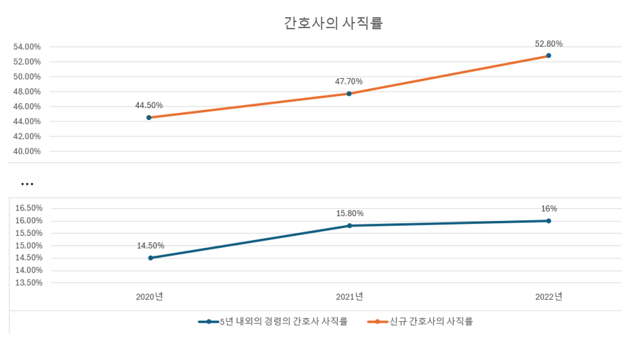
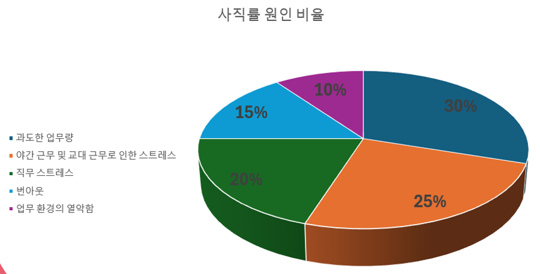

### 1. 프로젝트 소개

#### 1.1 배경 및 필요성


최근 실내 자율 주행 로봇에 대한 수요가 증가함에 따라, 로봇의 정확한 위치 추정과 경로 계획의 중요성이 부각되고 있습니다. 특히, 병원과 같은 복잡한 실내 환경에서는 장애물 회피와 효율적인 경로 탐색이 필수적입니다. 본 프로젝트는 UWB 기반 RTLS(Real-Time Locating System)와 컴퓨터 비전 기술을 결합하여 병원 환경에서 자율적으로 주행할 수 있는 로봇 시스템을 개발하게 되었습니다.

#### 1.2 목표 및 주요 내용
본 프로젝트의 목표는 병원 내에서 자율 주행 로봇이 정확한 위치와 각도를 실시간으로 추정하고, 이를 기반으로 경로 탐색을 수행할 수 있도록 하는 것입니다. 주요 내용으로는 UWB 기반 RTLS를 이용한 실내 위치 추정, ArUco Marker와 컴퓨터 비전을 활용한 각도 추정, 경로 탐색 알고리즘을 통한 효율적인 이동 경로 최적화 등이 포함됩니다.

### 2. 상세설계

#### 2.1 시스템 구성도


#### 2.2 사용 기술
- **Backend**:
  - Raspberry Pi - Python
  - ESP32 - FreeRTOS with C/C++
  - STM32 - C/C++
- **Frontend**:
  - React.js
- **RTLS**:
  - UWB (DWM3000)
- **Computer Vision**:
  - OpenCV
- **Protocols**:
  - HTTP, WebSocket, MQTT

### 3. 설치 및 사용 방법

#### 3.1 설치 요구사항
- Raspberry Pi 3B
- ESP32-Wrover
- STM32F103RBT6
- Python 3.9
- FreeRTOS
- Eclipse Mosquitto

#### 3.2 설치 및 실행 방법
1. 각 모듈에 적합한 펌웨어를 설치합니다.
2. 서버 구동:
   ```bash
   python -m uvicorn main:app --reload
   ```
   ```bash
   cmd mosquitto -v
    ```
3. GUI 접속:
  - 로컬 서버 주소에 접속하여 GUI를 확인하고 로봇을 제어할 수 있습니다.

### 4. 소개 및 시연 영상
프로젝트 소개 및 시연 영상은 [](https://www.youtube.com/watch?v=Q-QnjcWq2y8)를 클릭하여 확인하세요.

### 5. 팀 소개
- **윤석원**: 로봇 제어 및 RTLS 담당
  - UWB 기반 RTLS 연구 및 개발
  - ESP32, STM32 모듈 개발
  - 경로 및 제어 알고리즘 개발
- **한재안**: 사용자 상호작용 파트 담당
  - 웹 서버 설계 및 구현
  - GUI 설계 및 개발
- **구태헌**: 기능 구현 및 하드웨어 디자인
  - ArUco Marker 인식을 통한 각도 계산
  - 하드웨어 구조 설계 및 제작